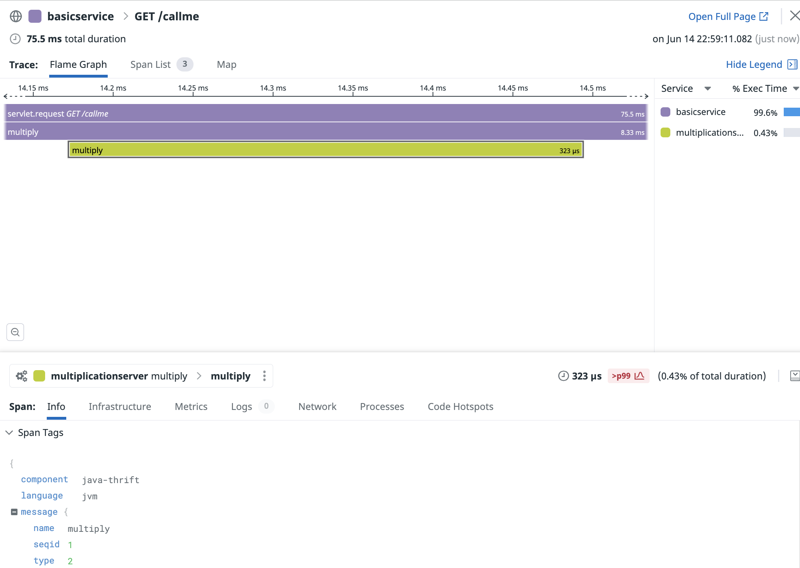

## Sample java application using opentracing and Apache thrift

[](https://sonarcloud.io/dashboard?id=com.codenotfound%3Aspring-kafka-hello-world)

### Introduction

The purpose of this tutorial is to show a simple java application using thrift opentracing  libraries.

* Goal
* Pre-requisites
* Clone the repository
* Directory structure of the project
* Overview of the application
* Building the application
* Testing the application
* Conclusion


### Goal of this lab

This tutorial is meant to showcase a practical example of a java application based on the Datadog sdk (`dd-trace-ot.jar`) and the thrift opentracing libraries.

This is meant to show how distributed tracing works between a simple java client and server based on Apache thrift.


### Pre-requisites

+ About 30 minutes
+ JDK 1.8 or later
+ Git client
+ A Datadog account with a valid API key
+ Your favorite text editor or IDE (Ex IntelliJ)
+ Docker
+ Gradle 5+ or Maven 3.2+

### Clone the repository

<pre style="font-size: 12px">
COMP10619:~ pejman.tabassomi$ git clone https://github.com/ptabasso2/javathriftopentracing.git
</pre>

### Directory structure of the project

The example below is the structure before having built the app.

```shell
COMP10619:minimal pejman.tabassomi$ tree
.
├── README.md
├── build.gradle
├── gradle
│   └── wrapper
│       ├── gradle-wrapper.jar
│       └── gradle-wrapper.properties
├── gradlew
├── settings.gradle
└── src
    ├── main
    │   ├── java
    │   │   ├── Minimal.java
    │   │   ├── MultiplicationClient.java
    │   │   ├── MultiplicationHandler.java
    │   │   ├── MultiplicationServer.java
    │   │   └── MultiplicationService.java
    │   └── resources
    │       └── multiple.thrift
    └── test
        └── JaegerTest.java

25 directories, 48 files
```


### Observations related to the application structure

* The application is based on four java classes.
* `MultiplicationClient` that is the code for the thrift java client
* `MultiplicationServer` that is the code for the thrift java server
* `MultiplicationService` the auto-generated code through the thrift compliler
* `MultiplicationHandler` the MultiplicationHandler class that implements an interface that has been auto-generated by the thrift compiler.


We are looking at how the context propagation occurs between the Java client and server

The scheme is described as follows:

The context propagation is built upon the following three correlation ids:

* `x-datadog-trace-id`
* `x-datadog-parent-id`
* `x-datadog-sampling-priority`

We will rely on `tracer.inject()/extract()` method invocations to get the context propagation working on both sides.
Those methods are implemented and are part of the thrift opentracing libraries.

The implementation logic can be summarized as follows:

* We use a span builder and start the span at the same time.
* In order to maintain the trace context over the process boundaries and remote calls,
  we need a way to propagate the span context over the wire.
  The OpenTracing API provides two functions in the Tracer interface to do that, `inject(spanContext, format, carrier)` and `extract(format, carrier)`.
* A Carrier is an interface or data structure that’s useful for inter-process communication (IPC). It “carries” the tracing state from one process to another.
  It allows the tracer to write key-value pairs via `put(key, value)` method for a given format.
* The `format` parameter refers to one of the three standard encodings (`TEXT_MAP`, `HTTP_HEADERS`, `BINARY`) that define how the span context gets encoded. In our case this will be the `TEXT_MAP` format.
* The `try-with-resources` block is used to activate the span and wrap the previous instructions.


### Client

**Initializing the tracer**

```java
static Tracer tracer = new DDTracer.DDTracerBuilder().build();
```

**Decorating the protocol object with a wrapper class (spanProtocol)**

```java
        TTransport transport;

        transport = new TSocket("localhost", 9090);
        transport.open();

        TProtocol protocol = new  TBinaryProtocol(transport);
        TProtocol spanProtocol = new SpanProtocol(protocol, tracer);
        MultiplicationService.Client client = new MultiplicationService.Client(spanProtocol);
```


**Issuing the call `call.multiply()`**

```java
        Span span = tracer.buildSpan("servlet.request").start();
        try(Scope scope = tracer.scopeManager().activate(span)){
            span.setTag(DDTags.SERVICE_NAME, "basicservice");
            span.setTag(DDTags.RESOURCE_NAME, "GET /callme");
            span.setTag(DDTags.SPAN_TYPE, "web");
            try {
               System.out.println("Tracing randomly");
               int product = client.multiply(3,5);
               System.out.println("3*5=" + product);
               Thread.sleep(20);
        }   catch(InterruptedException e){
             e.printStackTrace();
        }
            span.finish();
        }
```


### Server

**Receiving the request, extracting the context and building the child span**

```java
public class MultiplicationServer {

  public static MultiplicationHandler handler;

  public static MultiplicationService.Processor processor;

  static Tracer tracer = new DDTracer.DDTracerBuilder().build();


  public static void main(String [] args) {


    try {
      handler = new MultiplicationHandler();
      processor = new MultiplicationService.Processor(handler);
      TProcessor spanProcessor = new SpanProcessor(processor, tracer);

      Runnable simple = new Runnable() {
        public void run() {
          simple(processor, spanProcessor);
        }
      };

      new Thread(simple).start();
    } catch (Exception x) {
      x.printStackTrace();
    }
  }

  public static void simple(MultiplicationService.Processor processor, TProcessor spanProcessor) {
    try {
      TServerTransport serverTransport = new TServerSocket(9090);
      TServer server = new TSimpleServer(new Args(serverTransport).processor(spanProcessor));

      System.out.println("Starting the simple server...");
      server.serve();
    } catch (Exception e) {
      e.printStackTrace();
    }
  }

}
```


### Build the application

````shell
COMP10619:javathriftopentracing pejman.tabassomi$ gradle shadowJar

Deprecated Gradle features were used in this build, making it incompatible with Gradle 7.0.
Use '--warning-mode all' to show the individual deprecation warnings.
See https://docs.gradle.org/6.9.1/userguide/command_line_interface.html#sec:command_line_warnings

BUILD SUCCESSFUL in 1s
3 actionable tasks: 3 up-to-date

````

At this stage, the artifact that will be produced (`minimal-0.2.0.jar `) will be placed under the `javathriftopentracing/build/libs` directory that gets created during the build process.


### Test the application

1. In a first terminal window, run the following command:

````shell
COMP10619:javathriftopentracing pejman.tabassomi$ java -cp build/libs/minimal-0.2.0.jar MultiplicationServer
SLF4J: Failed to load class "org.slf4j.impl.StaticLoggerBinder".
SLF4J: Defaulting to no-operation (NOP) logger implementation
SLF4J: See http://www.slf4j.org/codes.html#StaticLoggerBinder for further details.
Starting the simple server...
````

2. In a second terminal window, run the following command:

````shell
COMP10619:javathriftopentracing pejman.tabassomi$ java -cp build/libs/minimal-0.2.0.jar MultiplicationClient
SLF4J: Failed to load class "org.slf4j.impl.StaticLoggerBinder".
SLF4J: Defaulting to no-operation (NOP) logger implementation
SLF4J: See http://www.slf4j.org/codes.html#StaticLoggerBinder for further details.
Tracing randomly
3*5=15
````

Going back to the first terminal window, the output should look like this. The `Multiply(3,5)` means that the client was able to make the request which went successful.

````shell
COMP10619:javathriftopentracing pejman.tabassomi$ java -cp build/libs/minimal-0.2.0.jar MultiplicationServer
SLF4J: Failed to load class "org.slf4j.impl.StaticLoggerBinder".
SLF4J: Defaulting to no-operation (NOP) logger implementation
SLF4J: See http://www.slf4j.org/codes.html#StaticLoggerBinder for further details.
Starting the simple server...
Multiply(3,5)

````


3. Checking the related APM trace in the Datadog UI

<p align="left">
  
</p>


